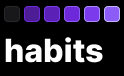
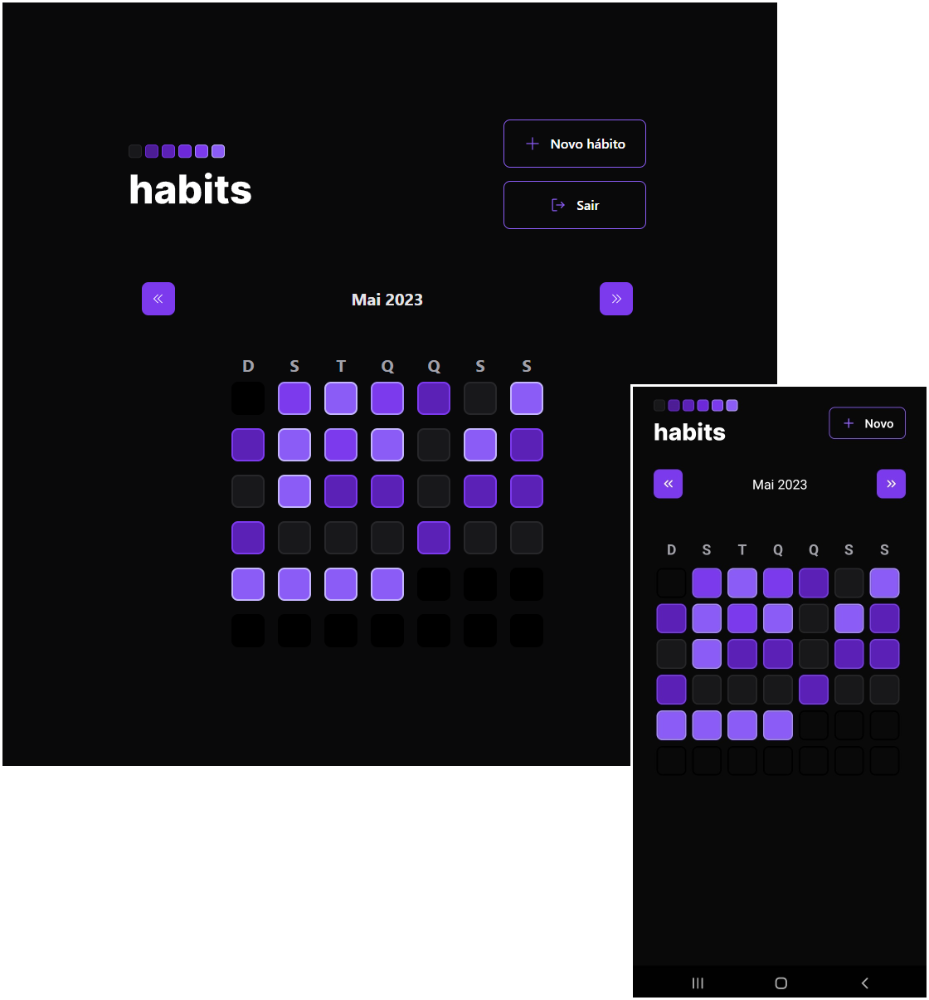

<h1 align="center">
  
</h1>

## 💻 Projeto

O Habits Tracker é um projeto que consiste de três aplicações (Server, Web e Mobile) que pemite usuários cadastrarem seus hábitos, ajudando a monitorar a frequência com que são cumpridos. Para realizar o cadastro de hábitos, o usuário deve se cadastrar no sistema usando seu e-mail de preferência e uma senha.

<h1 align="center">
  
</h1>

## ✨ Tecnologias

Esse projeto foi desenvolvido com as seguintes tecnologias:

- [TypeScript](https://www.typescriptlang.org/)
- [Express](https://expressjs.com/pt-br/)
- [Prisma](https://www.prisma.io/)
- [React](https://pt-br.reactjs.org/)
- [Tailwind CSS](https://tailwindcss.com/)
- [React Native](https://reactnative.dev/)
- [Expo](https://expo.dev/)
- [Day.js](https://day.js.org/)
- [Zod](https://zod.dev/)

## 🚀 Como executar

- Clone o repositório
- Navegue até a pasta de cada aplicação (mobile, server e web) e instale as dependências com `npm install`
- Siga as instruções para cada uma das aplicações abaixo:

### server

- Crie o banco de dados e execute as migrations com `npx prisma migrate dev`
- Renomeie o arquivo `.env.example` para `.env` e configure suas variáveis de ambiente
- Inicie o servidor com `npm run dev`

### web

- Renomeie o arquivo `.env.example` para `.env.local` e configure suas variáveis de ambiente
- Inicie a aplicação web com `npm run dev`

### mobile

- Renomeie o arquivo `env.example.ts` para `env.ts` e configure suas variáveis de ambiente
- Inicie a aplicação mobile com `npx expo start`

## 📄 Licença

Esse projeto está sob a licença MIT. Veja o arquivo [LICENSE](LICENSE) para mais detalhes.

---

Desenvolvido por Tiago Faria.
